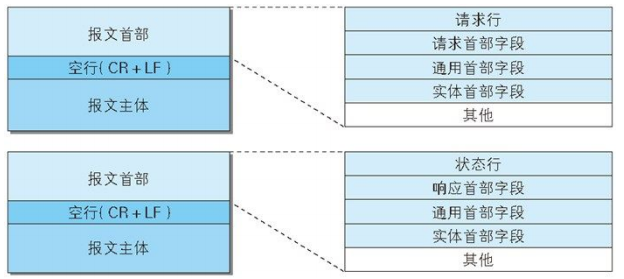

## 一、Https

### 1.1 Http的缺点

- 通信使用明文
- 不验证通信放的身份（可以通过session和cookie解决，但是仍然存在session劫持的风险
- 无法证明报文得完整性

### 1.2 Https

Http协议没有加密机制，但可以通过和SSL（Secure Socket Layer，安全套接层）或TLS（Transport Layer Security,安全层传输协议）得组合使用。

与SSL组合使用的HTTP被称为Https。

- **SSL:** 位于传输层和应用层之前，为应用层得各个协议提供加密服务

 SSL记录协议（SSL Record Protocol）：它建立在可靠的传输协议（如TCP）之上，为高层协议提供数据封装、压缩、加密等基本功能的支持。 SSL握手协议（SSL Handshake Protocol）：它建立在SSL记录协议之上，用于在实际的数据传输开始前，通讯双方进行身份认证、协商加密算法、交换加密密钥等。

- **Https安全性**

SSL加密算法是对称加密，但是SSL对称加密的密钥用服务器放得证书进行了非对称加密

## 二、浏览器输入URL->>显示主页得过程

1. 浏览器查找域名得IP地址（所属层：应用层；相应协议：DNS）

DNS(Domain Name System)查找过程：先在本地缓存找（主机、路由器），找不到就在DNS服务器系统中进行递归查询

2. 将获得得IP协议写入Http请求头，并发送Http请求（所属曾：应用层；相应协议：Http）
3. 建立TCP连接，传输Http请求报文（所属层：传输层；相应协议：Http）

TCP实现面向连接的端对端可靠传输：为了方便通信，将HTTP请求报文分割成报文段

4. 在路由线路里尽情飘荡tcp报文段（所属层：网络层；相应协议：IP，ARP，路由协议）

一边中转一边传送（下一跳）

5. 将ip报文组装成帧（所属层：数据链路层；相应协议：可多了，说不清）
6. 原样对应到接收过程和回传http响应报文过程

## 三、cookie与session

- **cookie**

由本地计算机保存一些用户操作的历史信息（包括登录信息），并在用户再次访问该站点时浏览器通过HTTP协议将本地cookie内容发送给服务器，从而完成验证，或继续上一步操作。

根据生命期不同分成两种：会话cookie和持久cookie。

| cookie类型 | 优点                                                         | 缺点                                                         |
| ---------- | ------------------------------------------------------------ | ------------------------------------------------------------ |
| 签名cookie | 验证cookie所需的一切信息都存在cookie里面，cookie可以包含额外的信息（additional information），并且对这些信息进行签名也很容易。 | 正确地处理签名很难，很容易忘记对数据进行签名，或者忘记验证数据的签名，从而造成安全漏洞。 |
| 令牌cookie | 添加信息非常容易，cookie的体积非常小，因此移动终端和速度较慢的客户端可以更快地发送请求 | 需要在服务器中存储更多信息，如果使用的是关系数据库，那么载入和存储cookie的代价可能会很高。 |

- **session**

由服务器保存用户操作的例是信息。服务器使用session id来标识session，session id由服务器负责产生，保证随机性与唯一性，相当于一个随机密钥。

1. 生成全局唯一标识符（sessionid）
2. 开辟数据存储空间
3. 发送session id

- **常用的两种session id 发送方式**

1. 通过在会话cookie头中写入session id。优点：简单。缺点：客户端禁用cookie直接扑街
2. URL重写，在返回给用户的页面里追加session标识符。缺点：session容易被劫持（可以通过其他办法如追加token来解决）

## 四、Http报文结构

- **请求行（请求报文）**  请求方法、请求URI、HTTP版本
- **状态行（响应报文）**  响应结果的状态码、原因短语和HTTP版本
- **首部字段**  包含请求和响应的各种条件和属性的各类首部。

一般有四种首部，分别是：通用首部、请求首部、响应首部和实体首部。可能包含HTTP的RFC里未定义的首部

## **五、状态码**

|      | 类别                             | 原因短语                   |
| :--- | -------------------------------- | -------------------------- |
| 1xx  | Informational（信息性状态码）    | 接收的请求正在处理         |
| 2xx  | Success（成功状态码）            | 请求正常处理完毕           |
| 3xx  | Redirection（重定向状态码）      | 需要进行附加操作以完成请求 |
| 4xx  | Client Error（客户端错误状态码） | 服务器无法请求             |
| 5xx  | Server Error                     | 服务器请求处理出错         |

### 5.1 2xx成功

- **200 OK**  

表示从客户端发来的请求在服务器端被正常处理了

- **204 No Content**  

表示服务器接受的请求已成功处理，但在返回的响应报文中不含实体的主体部分，也不允许返回任何实体的主体

- **206 Partial Content**  

表示客户端进行了范围请求，并且服务器成功执行了这部分的GET请求。响应报文通过Content-Range指定范围的实体内容。

### 5.2 3xx重定向

- **301 Moved Permanently**

永久性重定向。该状态吗表示请求的资源被分配了新的URI，以后应使用资源现在所指的URI。

- **302 Found**

临时性重定向。表示请求的资源被分配了新的URI，希望本次能使用新的URI访问。

- **303 See other**

与302类似，但303明确要求客户端采用GET方法获取资源。

- **304 Not Found**

## 六、TCP

- 怎么保证可靠性
  - 12字节的伪首部，进行校验和计算
  - 确认应答机制
- 怎么保证有序
  - 序列号和滑动窗口
- 怎么保证不重复
  - 序列号，重复就丢弃并重新发送ACK