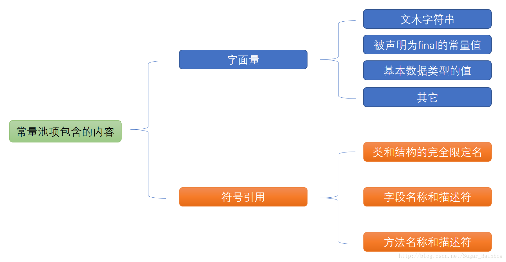
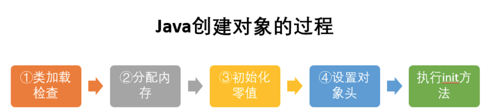

## 一、Java内存区域与内存溢出异常

### 1.1 运行时数据区域

#### 1.1.1 程序计数器(私有)

**Def：** 程序计数器是一块较小的内存空间，它可以看作是当前线程所执行的字节码的行号指示器。字节码解释器工作时就是通过改变这个计数器的值来选取下一跳需要执行的字节码指令，分支、循环、跳转、异常处理、线程恢复等基础功能都需要依赖这个计数器来完成。

**作用：** 1.代码的流程控制 2.线程切换时恢复现场

**Notation：** 每条线程都有一个独立的线程计数器，唯一一个不会产生OutOfMemoryError 的内存区域。它与线程同生同死。

#### 1.1.2 虚拟机栈(私有)

**Def：**虚拟机栈描述的是Java方法执行的内存模型：每个方法在执行的同时都会创建一个栈帧(Stack Frame)用于存储局部变量表、操作数栈、动态链接、方法出口等信息，每一个方法从调用直至执行完成的过程，就对应着一个栈帧在虚拟机栈中入栈到出栈的过程。

**两种异常状况：** StackOverflowError和OutOfMemoryError

- **StackOverflowError：** 线程请求的深度大于虚拟机所允许的深度
- **OutOfMemoryError：** 如果虚拟机栈可以动态扩展，如果扩展时无法申请到足够的内存抛出该异常。

**Notation：** 为虚拟机执行Java方法服务。

#### 1.1.3 本地方法栈(私有)

作用类似于虚拟机栈，产生的异常也同虚拟机栈

**Notation：** 为虚拟机执行Native方法服务。

#### 1.1.4 Java 堆(线程共享)

**Def：** Java堆是所有线程共享的一块内存区域，在虚拟机启动时启动。唯一目的就是存放对象实例，几乎所有的的对象实例都在这里分配内存。是Java虚拟机所管理的内存中最大的一块。

**划分：** 新生代（Eden空间、From Survivor空间、To Survivor空间）、老生代（Tentired）

**Notation：** 垃圾收集器管理的主要区域。

**唯一异常状况：** 当堆中没存内存完成实例分配，并且堆也无法再扩展时，将抛出OutOfMemoryError异常。

#### 1.1.5 方法区(线程共享)

**作用：** 存储已被虚拟机加载的类信息、常量、静态变量、即时编译后的代码等数据。

**唯一异常状况：** 当方法区无法满足内存分配需求时，将抛出OutOfMemoryError异常。

#### 1.1.6 运行时常量池(方法区的一部分)

**Class文件组成：** 类的版本、字段、方法、接口和常量池信息

**唯一异常状况：** 当常量池无法再申请到内存时，将抛出OutOfMemoryError异常。

**Notation：** Jdk1.7之后，JVM将常量池从方法去中移了出来，再Java堆中开辟了一块区域存放运行时常量池

#### 1.1.7 直接内存(非Java内存区域的一部分)

**唯一异常状况：** 当各个内存区域总和大于物理内存限制时，将抛出OutOfMemoryError异常。

### 1.2 对象创建、内存布局、访问定位

#### 1.2.1 对象创建

1. **类加载检查：**

虚拟机遇到一条new指令时，首先将去检查这个指令的参数是否能在常量池中定位到这个类的符号引用，并且检查这个符号引用代表的类是否已被加载、解析和初始化过。如果没有，那必须先执行相应的类检查过程。

2. **分配内存：**

在类加载检查通过后，接下来虚拟机将为新生对象分配内存。对象所需内存的大小在类加载完成后便可确定，为对象分配空间的任务等同于把一块确定大小的内存从Java堆中划分出来。分配方式有“指针碰撞”和“空闲列表”两种，选择哪种分配方式有Java是否规整决定，而Java堆是否规整又由垃圾收集器是否带有压缩整理功能决定。

- **指针碰撞** 

- **空闲列表**  有点类似物理存储管理中连续内存分配

3. **初始化零值**
4. **设置对象头**

5. **执行init方法**

#### 1.2.2 对象的内存布局

- **对象头（Header）**  包括用于存储对象自身的运行时数据、指向他的类元数据的类型指针
- **实例数据**  对象真正存储的有效信息
- **对其填充**  类似c语言结构题4字节对齐

#### 1.2.3 对象的访问定位

Java栈中存储了指向对象引用的reference数据，如何通过reference操作堆上的具体对象就是对象的访问定位。主流的访问方式有使用句柄和直接指针两种。

- **句柄**

reference指向句柄池，句柄池包含指向对象实例数据的指针和指向对象类型数据的指针。

- **直接指针**

reference中存储的直接就是对象地址

## 二、垃圾收集器与内存分配策略

### 2.1 概述

- **回收哪些内存**
- **什么时候回收**
- **如何回收**

### 2.2 判断对象死亡的两种方法

- **引用计数法（非虚拟机使用方法）**  有引用就加一没有引用就减一，很傻瓜，也很废
- **可达性计数法**  任何不可达GC Roots的对象被回收

原理：简单的说就是把所有的对象想像成森林如果某个树的根节点不在GC Roots上就回收这棵树。

虚拟机管理的GC Roots对象：虚拟机栈、方法区中的静态属性、方法区的常量、native方法引用的对象

### 2.3 垃圾收集算法

- **标记-清除** 

缺点：标记和清除两个过程的效率都不高；还容易引起连续分配里最让人生厌的内存碎片

- **复制**

两块内存区域，回收时复制到另一块区域，解决了内存碎片和效率问题（一个过程就解决）

内存区域的划分已变为现在虚拟机使用分代布局

- **标记-整理**
- **分代-收集**

新生代采用复制算法，老年代采用标记-整理算法。

### 2.4 垃圾收集器