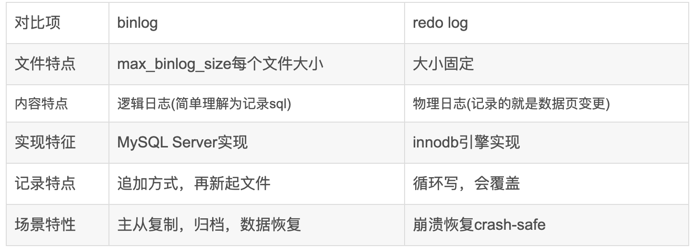

## 一、存储引擎

**两种主要的引擎**

### 1.1 MyISAM

**特点：**

- **表锁：**读取时会对需要读到的所有表加共享锁，写入时则对表加排他锁。但是在表有读取查询的同时，也可以往表中插入新的记录
- **修复：**手工或自动执行检查和修复操作，但是不支持事务
- **索引特性：**支持全文索引，支持blob、text长字段索引

**总结：**成也表锁，败也表锁

### 1.2 InnoDBdefault

- **行锁：** 既支持行锁也支持表锁，默认行锁
- **外键：** 支持外键
- **MVCC：** 支持多版本并发控制

### 1.3 补充知识点MVCC

1. 应对高并发事务，MVCC比单纯的加锁更高效
2. 只在READ COMMITTED和REPEATABLE READ两个隔离级别下工作
3. MVCC可以使用乐观锁和悲观锁来实现
4. InnoDB的MVCC是在每行记录保存三个隐藏的列来实现的（DB_TRX_ID只是最后一次插入或更新的事务标识符、DB_ROLL_ID、DB_ROW_ID自增行（InnoDB的隐藏列）

## 二、索引

### 2.1 索引的类型

- **B+Tree索引** （靠左列匹配）
- **哈希索引** （hash表） 

缺点：无法排序、无法根据索引列匹配查询、不支持范围查找

- **空间数据索引**

### 2.2 索引的优点

- 大大减少了服务器需要扫描的数据量
- 索引可以帮助服务器避免排序和临时表
- 索引可以将随机IO变为顺序IO

### 2.3 索引相关的面试题

#### 2.3.1 创建索引的语句

CREATE [UNIQUE] INDEX index_name ON table_name (column_list)

ALTER TABLE table_name ADD INDEX [index_name] (column_list)

#### 2.3.2 什么情况下导致索引失效

1. 如果where语句中有需要数据库动脑子的表达式
2. 对于多列索引，不使用最左列
3. like查询是以%开头
4. 如果列类型是字符串，那一定要在条件中将数据使用引号引用起来,否则不使用索引
5. 如果mysql估计使用全表扫描要比使用索引快,则不使用索引

## 三、事务

### 3.1 事务的四大特性

- **原子性**  事务是最小的执行范围，不允许分割
- **一致性**  执行事务前后，数据保持一致，多个事务对同一个数据读取的结果是相同的
- **隔离性**  并发访问数据库时，一个用户的事务不被其他事物所干扰，各并发事务之间数据库是独立的
- **持久性**  一个事务被提交之后。它对数据库中的改变是持久的。

### 3.2 并发事务带来哪些问题

- **脏读**  类似于线程的可见性
- **丢失修改**  类似于线程的原子性
- **不可重复读**  指同一条数据，在较短时间间隔的两次读取，读取的结果不同；重在修改
- **幻读**  指同一张表，在较短时间间隔的两次读取，读取的记录内容不同；重在新增和删除

### 3.3 事务隔离级别

- **READ-UNCOMMITTED：**  允许读取尚未提交的数据变更
- **READ-COMMITTED：** 允许读取并发事务已经提交的数据
- **REPEATABLE-READ：** 对同一字段的多次读取结果都是一致的，除非数据是被本身事务自己所修改
- **SERIALIZABLE：** 完全服从acid

| 隔离级别         | 脏读 | 不可重复读 | 幻读 |
| ---------------- | ---- | ---------- | ---- |
| READ-UNCOMMITTED | 勾   | 勾         | 勾   |
| READ-COMMITTED   | ×    | 勾         | 勾   |
| REPEATABLE-READ  | ×    | ×          | 勾   |
| SERIALIZABLE     | ×    | ×          | ×    |

## 四、主从复制

### 4.1 原理

1. 主服务器操作数据，并将数据写入Binary log
2. 主库创建binlog dump thread把binlog的内容发动到从库
3. 从库启动并发起连接，连接到主库
4. 从库启动之后，创建一个I/O线程，读取主库传过来的binlog内容并写入到relay log
5. 从库启动之后，创建一个SQL线程，从relay log里面读取内容，从Exec_Master_Log_Pos位置开始执行读取到的更新事件，将更新内容写入到slave的db

## 五、三大日志log

### 5.1 bin_log

- **作用**

binlog用于记录数据库执行的写入性操作(不包括查询)信息，以二进制的形式保存在磁盘中。binlog是MySQL的逻辑日志，并且由Server层进行记录，任何存储引擎都会记录binlog日志。

```apl
binlog用于记录数据库执行的写入性操作(不包括查询)信息，以二进制的形式保存在磁盘中。binlog是MySQL的逻辑日志，并且由Server层进行记录，任何存储引擎都会记录binlog日志。
binlog是通过追加的方式进行写入的，可以通过max_binlog_size参数设置每个binlog文件的大小，当文件大小达到给定值之后，会生成新的文件来保存日志。
 一个事务的binlog日志不会被拆到两个binlog文件。
```
- **使用场景**
  - 主从复制：在Master端开启binlog，然后将binlog发送到各个Slave端，Slave端重放binlog从而达到主从数据一致
  - 数据恢复：通过使用mysqlbinlog工具来恢复数据
- **刷盘时机**  （sync_binlog

### 5.2 redo_log

**修改随时刷回磁盘带来的问题：**

1. 因为Innodb是以**页**为单位进行磁盘交互的，而一个事务很可能只修改一个数据页里面的几个字节，这个时候将完整的数据页刷到磁盘的话，浪费资源；
2. 一个事务可能涉及修改多个数据页，并且这些数据页在物理上并不连续，使用随机IO写入性能太差

- **作用：**
  - 只记录事务对数据页做了哪些修改，这样就能解决性能问题了(相对而言文件更小并且是顺序IO)
  - 具备crash-safe 能力，提供断电重启时解决事务丢失数据问题；
  - 提高性能：先写redo log记录更新。当等到有空闲线程、内存不足、redo log满了时`刷脏`。写 redo log 是顺序写入，刷脏是随机写，节省的是随机写磁盘的 IO 消耗（转成顺序写），所以性能得到提升。
- **组成和写入：**
  - redo log包括两部分：一个是内存中的日志缓冲(redo log buffer)，另一个是磁盘上的日志文件(redo log file)。MySQL每执行一条DML语句，先将记录写入redo log buffer，后续某个时间点再一次性将多个操作记录写到redo log file。这种先写日志，再写磁盘的技术就是MySQL里经常说到的WAL(Write-Ahead Logging) 技术。
- **redo log 两阶段提交**

两阶段提交可以确保 binlog 和 redo log 数据一致性。更新内存后引擎层写 redo log 将状态改成 prepare 为预提交第一阶段，Server 层写 binlog，将状态改成 commit为提交第二阶段。

redo log 容灾恢复过程：

- 判断 redo log 是否完整，如果判断是完整（commit）的，直接用 redo log 恢复
- 如果 redo log 只是预提交 prepare 但不是 commit 状态，这个时候就会去判断 binlog 是否完整，如果完整就提交 redo log，用 redo log 恢复，不完整就回滚事务，丢弃数据。



### 5.3 undo_log

- **功能**

 undo log是逻辑日志、回滚日志。比如一条修改 +3 的逻辑语句，Undo log 会记录对应一条 -3 的逻辑日记，一条插入语句则会记录一条删除语句，这样发生错误时，根据执行 Undo log 就可以回滚到事务之前的数据状态。

- **作用**
  - 回滚数据：当程序发生异常错误时等，根据执行 undo log 就可以回滚到事务之前的数据状态，保证原子性，要么成功要么失败。
  - MVCC 多版本并发控制（Multi-Version Concurrency Control）：通过 undo log 找到对应的数据版本号，是保证 MVCC 视图的一致性的必要条件。通过记录数据项历史版本的方式，来提升系统应对多事务访问的并发处理能力。